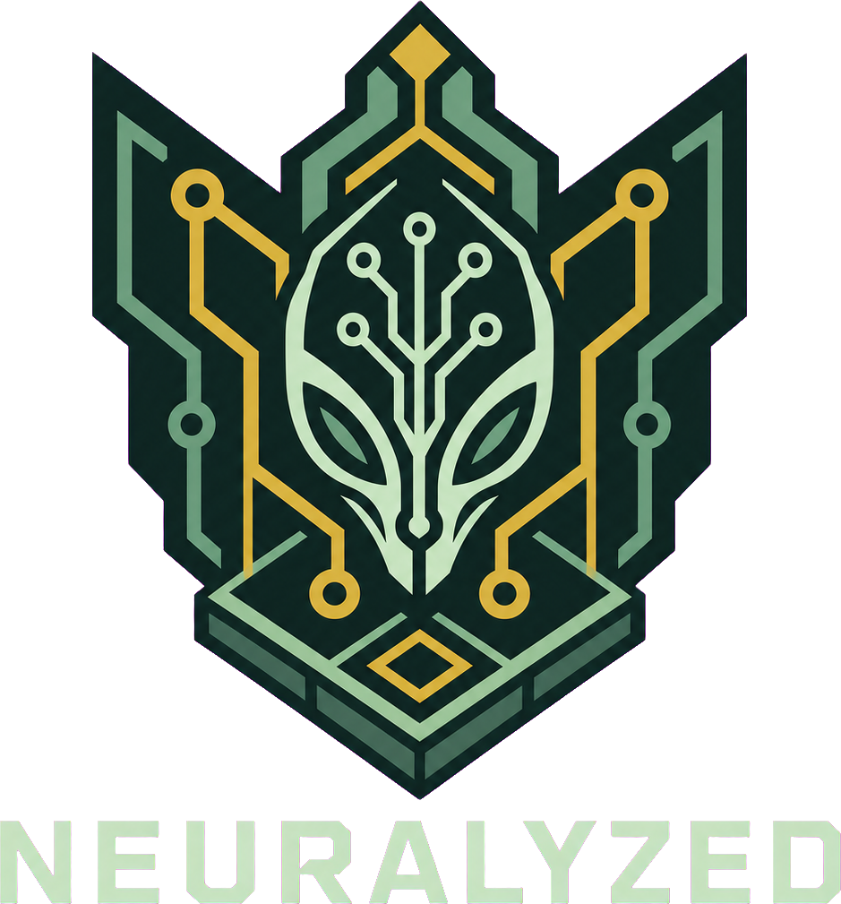

<p align="center">
  
</p>

# NEURALYZED

An isometric browser roguelike with a Rust/WebAssembly simulation, adaptive planning, and a handwritten atlas renderer. Play manually or let the autonomous agent plan a run.

## Play

**[Play NEURALYZED in your browser](https://stackcodium.github.io/neuralyzed/)**

**[Watch the 93-second gameplay video](https://github.com/stackcodium/neuralyzed/releases/download/showcase/neuralyzed.mp4)**

<p align="center">
  <a href="https://github.com/stackcodium/neuralyzed/releases/download/showcase/neuralyzed.mp4">
    
  </a>
  <br>
  <em>Gameplay preview. Click it to watch the full video.</em>
</p>

Choose an agent, then select **Auto** for a planned run or use the keyboard. Press **?** at any time for the complete in-game keymap.

| Action | Keys |
| --- | --- |
| Move or melee | Arrow keys or H J K L |
| Move diagonally | Y U B N |
| Wait | Space or . |
| Pick up | G |
| Inventory | I |
| Quick fire / aimed fire | F / Shift+F |
| Stairs or interact | Enter |

Strategic full search is the default planning mode. **Settings** also offers Quick, Tactical, and Adaptive modes; Adaptive benchmarks the device for less than one second and selects a suitable level.

## Run locally

The checked-in browser release has no package-install step. Start it with either Node.js or Bun:

```sh
# Node.js
node scripts/serve.mjs

# Or Bun
bun run serve
```

The server prints the local address when it starts. Open that address in your browser. The game must be served this way because browsers restrict workers and WASM when an HTML file is opened directly.

## Why it works this way

- The Rust core is authoritative for rules, simulation, combat, inventory, seeded RNG, and planning.
- The Rust core is compiled to WebAssembly and runs behind a dedicated Web Worker, keeping expensive planning off the UI thread.
- Adaptive lookahead calibrates itself to the device under a capped time budget.
- A handwritten WebGL2/canvas renderer presents the isometric atlas, combat facing, movement, and effects without a game engine.
- The final atlas comes from a repeatable asset pipeline rather than hand-assembled sprite folders.
- Seeded fixtures and cross-boundary tests protect reproducible outcomes and the browser snapshot protocol.
- The release can also be exported as one self-contained HTML file.

## How we used GPT-5.6 and Codex CLI

GPT-5.6 in Codex CLI was the primary engineering model used to build the complete submitted game. It worked across the original multi-project workspace, where gameplay rules, the Rust runtime, and the isometric frontend had clear ownership boundaries. This let one Codex workflow reason about the whole product while keeping simulation code out of the presentation layer.

| Area | What GPT-5.6 did through Codex CLI |
| --- | --- |
| Game and architecture | Implemented and connected the reproducible Rust simulation, WASM bridge, typed worker protocol, browser interface, and handwritten WebGL2 and Canvas renderer. |
| Autoplay | Built the adaptive lookahead and ensemble workflow, including planning from the current live state, comparing candidate runs, selecting the strongest trajectory, and replanning after a human takes control. |
| Optimization | Replayed difficult seeds, inspected individual decisions, found wasted movement and state errors, compared policies across seed batches, and protected improvements with stored outcomes and reproducible traces. |
| Asset pipeline | Built and ran the pipeline from the visual catalog through character analysis, orientation guides, state sheets, background removal, alpha trimming, normalization, validation, manifests, and atlas assembly. |
| Presentation | Implemented movement interpolation, combat facing, projectiles, damage timing, teleport effects, responsive dialogs, HUD behavior, and the planning overlay. It also diagnosed visual bugs by running the real game and inspecting browser captures. |
| Testing and release | Repeatedly built the Rust, WASM, TypeScript, and browser targets, added regression tests, ran complete autonomous missions, produced the self-contained HTML export, and verified the GitHub Pages deployment. |

The asset pipeline used specialized tools for the image stages. GPT-5.6 designed, implemented, debugged, and orchestrated the workflow in Codex CLI. `gpt-image-2` produced raster candidates, and BiRefNet removed backgrounds before the scripted cleanup and atlas stages.

Human review stayed part of every important decision. I chose the game design, architecture boundaries, visual direction, optimization goals, and final behavior. I also selected visual candidates and reviewed identity, facing direction, animation continuity, and bad frames before assets entered the runtime atlas. GPT-5.6 handled the engineering loop: inspect the current system, propose a focused change, implement it, run the real project, analyze failures, and continue until the result passed.

## Build from source

Source builds require [Bun](https://bun.sh/), [Rust](https://www.rust-lang.org/tools/install), and `wasm-bindgen-cli` 0.2.126. JavaScript packages do not require a separate install step.

```sh
rustup target add wasm32-unknown-unknown
cargo install wasm-bindgen-cli --version 0.2.126 --locked
bun run build
```

Useful commands:

| Command | Purpose |
| --- | --- |
| `bun run dev` | Build and start the local server |
| `bun run build` | Create the multi-file browser build in `dist/` |
| `bun run test` | Run TypeScript, Rust-core, and WASM tests |
| `bun run test:browser` | Smoke-test the served game in Brave/Chromium |
| `bun run export:single` | Create `dist/neuralyzed.html` (requires `cwebp`) |

## Architecture

```text
Browser UI ──> Web Worker ──> WASM bridge ──> Rust game + planner
     │                                             │
     └──── isometric renderer <── render snapshot ─┘
```

- `rust/src/`: game rules, simulation, seeded RNG, and planner
- `rust/wasm/`: browser-facing WebAssembly bridge
- `src/renderer/`: isometric atlas renderer and visual effects
- `src/runtime/`: browser worker and typed message protocol
- `src/isometric-rust-wasm-browser.ts`: browser UI and presentation loop
- `assets/` and `rust/assets/`: portraits, interface art, and runtime atlas

See [Development](docs/DEVELOPMENT.md) for setup details and [Contributing](CONTRIBUTING.md) before submitting changes.

## Verification

The release was validated locally with the full automated suite, a clean source build, both Node.js and Bun HTTP servers, a headless Brave mission-start smoke test, and a manually opened self-contained `neuralyzed.html` export.

## License and asset rights

No open-source license is granted by this repository. Code and assets remain all rights reserved unless a separate license or attribution file says otherwise. The repository is public so people can inspect and run the project, but redistribution or reuse is not granted.
